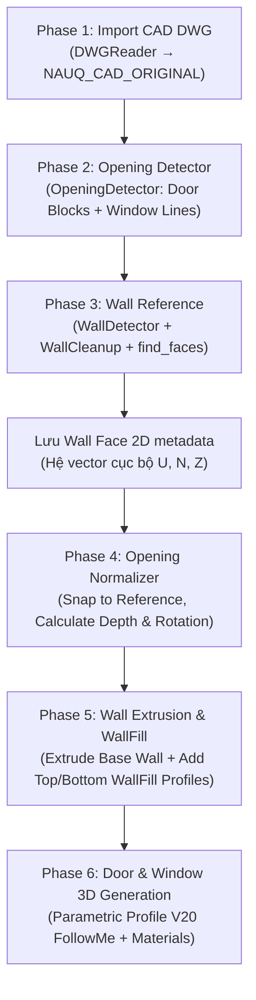

# ARCHITECTURE — NAUQ CAD TO 3D

## 1. Triết lý thiết kế: "Wall Face 2D là Source of Truth"

### Vấn đề của phương pháp cũ (Boolean/WallCutter)
- Dựng khối tường đặc (full solid wall) rồi đục lỗ cửa (cutter box + `intersect_with` hoặc Boolean) gây vỡ topology, lỗi mặt coplanar, làm hỏng các góc tường xiên và chạy rất chậm trên mô hình lớn.

### Giải pháp kiến trúc mới
1. **CAD không có nét tường tại vị trí cửa:** Bản vẽ CAD chuẩn vốn đã có khoảng trống tại vị trí cửa đi/cửa sổ. Khi đưa các đường nét sạch (`cleaned_pairs`) vào SketchUp và gọi `edge.find_faces`, SketchUp sinh ra các **Face 2D đại diện chính xác cho các mảng tường hiện hữu**.
2. **Base Wall:** Mọi Face 2D tạo từ CAD được dùng trực tiếp làm tiết diện đáy và được extrude (`pushpull`) lên đúng chiều cao tường (`wall_height`).
3. **WallFill (Bổ sung phần trống):** Opening (cửa đi / cửa sổ) chỉ là dữ liệu mô tả vùng trống. `WallFillBuilder` tạo thêm geometry bổ sung tại các vùng trống đó:
   - **Cửa đi (Door):** 1 khối WallFill nằm trên đầu cửa từ `opening_top` $\rightarrow$ `wall_top`.
   - **Cửa sổ (Window):** 2 khối WallFill: 1 khối dưới bậu cửa (`base_z` $\rightarrow$ `opening_bottom`) và 1 khối trên đố cửa (`opening_top` $\rightarrow$ `wall_top`).
4. **Không Boolean, Không WallCutter, Không đục lỗ:** Base Wall và WallFill được tạo và pushpull trong cùng một operation duy nhất vào container `NAUQ_WALLS`.

---

## 2. Pipeline quy trình tổng thể (6 Phases)

---

## 3. Hệ trục tọa độ cục bộ (Local Coordinate Basis)

Để đảm bảo thuật toán hoạt động chính xác với mọi góc xoay tường (kể cả tường chéo, tường cong, tường vát):
- Vector **$U$**: Hướng chạy dọc theo tim tường (Song song với phương mở cửa).
- Vector **$N$**: Hướng vuông góc với bề mặt tường (Chỉ độ dày tường $D$).
- Vector **$Z$**: Hướng thẳng đứng (`[0, 0, 1]`).

Mọi kích thước mở cửa ($W$), độ dày tường ($D$), cao độ lanh-tô và bậu cửa sổ đều được tính toán trên hệ cơ sở $(U, N, Z)$ cục bộ, độc lập với trục $X, Y$ toàn cục của SketchUp.
