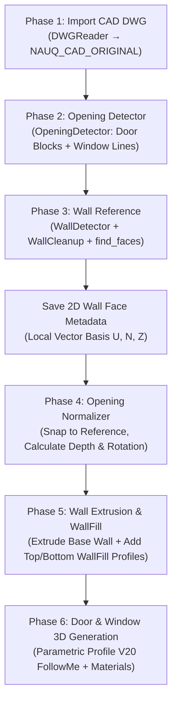

# ARCHITECTURE — NAUQ CAD TO 3D

## 1. Design Philosophy: "2D Wall Face as Source of Truth"

### The Flaws of Boolean/WallCutter Approaches
- Creating a solid unbroken wall and punching openings with cutter boxes via `intersect_with` or Boolean subtraction breaks 3D mesh topology, produces coplanar seam artifacts, corrupts oblique/skewed corners, and scales poorly on large architectural models.

### The Modern Architectural Solution
1. **CAD Drawings Naturally Have Openings:** Standard CAD floor plans omit wall lines at door and window locations. When cleaned edge pairs (`cleaned_pairs`) are inserted into SketchUp and evaluated with `edge.find_faces`, SketchUp naturally constructs **2D faces representing existing solid wall sections**.
2. **Base Wall Extrusion:** Every 2D wall face derived from CAD serves directly as the bottom profile and is extruded (`pushpull`) up to the specified `wall_height`.
3. **WallFill (Aperture Infill Geometry):** Openings (doors and windows) represent spatial clearance metadata. `WallFillBuilder` constructs supplemental solids within opening gaps:
   - **Door:** 1 WallFill lintel block spanning from `opening_top` $\rightarrow$ `wall_top`.
   - **Window:** 2 WallFill blocks: a sill block (`base_z` $\rightarrow$ `opening_bottom`) and a lintel block (`opening_top` $\rightarrow$ `wall_top`).
4. **Zero Booleans, Zero WallCutters, Zero Punching:** Base walls and WallFills are constructed and extruded in a single unified operation into the `NAUQ_WALLS` container group.

---

## 2. Pipeline Overview (6 Phases)

---

## 3. Local Coordinate Basis

To ensure geometric robustness across arbitrary wall orientations (skewed, angled, or curved walls):
- **Vector $U$**: Runs longitudinally along the wall baseline (parallel to the door/window opening span).
- **Vector $N$**: Normal to the wall face (defines wall thickness $D$).
- **Vector $Z$**: Vertical unit vector (`[0, 0, 1]`).

All opening apertures ($W$), wall thicknesses ($D$), lintel elevations, and window sill heights are calculated within the local $(U, N, Z)$ coordinate system, completely decoupled from SketchUp's global $X, Y$ axes.

---

## Tóm tắt tiếng Việt (Vietnamese Summary)

### Triết lý "Wall Face 2D là Source of Truth"
1. **Không dùng Boolean:** Thay vì dựng tường đặc rồi đục lỗ bằng Boolean (gây rách mặt và lag), plugin tận dụng các khoảng trống vốn có trên bản vẽ CAD. Khi gọi `find_faces`, SketchUp tạo các Face 2D chính xác của chân tường.
2. **Base Wall + WallFill:** 
   - Tiết diện đáy được pushpull trực tiếp lên độ cao trần (`wall_height`).
   - Các lỗ mở chỉ cần đùn thêm các khối lanh-tô trên đầu cửa và bậu dưới chân cửa sổ (`WallFill`), không cần đục khoét.
3. **Quy trình 6 giai đoạn:** Import DWG $\rightarrow$ Nhận diện cửa $\rightarrow$ Tạo Wall Reference $\rightarrow$ Chuẩn hóa lỗ mở $\rightarrow$ Extrude tường & WallFill $\rightarrow$ Sinh mô hình cửa 3D V20.
4. **Hệ trục $(U, N, Z)$ cục bộ:** Mọi tính toán kích thước $W \times H \times D$ đều dựa trên hệ tọa độ cục bộ theo từng vách tường, đảm bảo tường chéo, tường xiên đều chuẩn xác.
